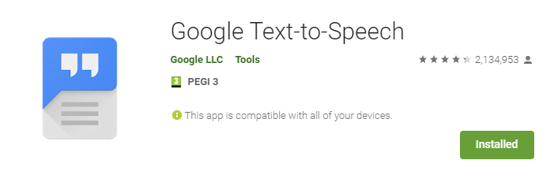
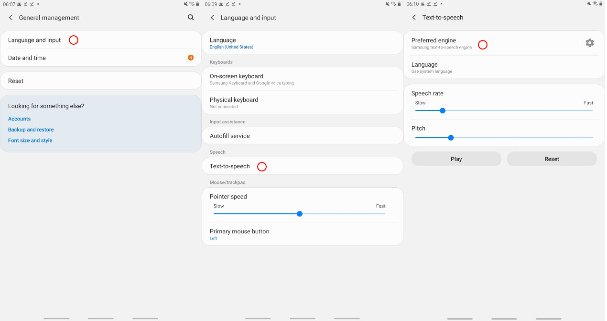
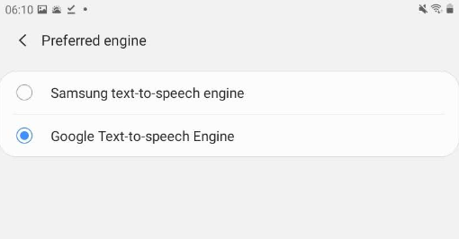
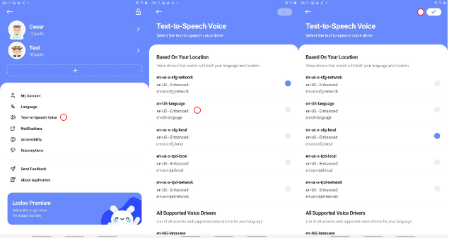
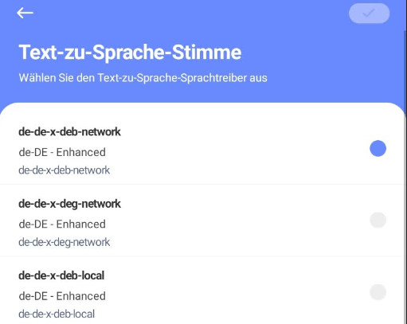

Most Samsung mobile devices infamously comes with their own TTS Drivers called Samsung Text-to-Speech. Access to this speech synthesiser is usually buggy, their support for languages other than English is sparse or not existed.

If you are having issues with your device sounding "weird", follow this steps to change your default speech drives into "Google Text-to-Speech"

## Install Google TTS

Most Samsung devices comes with Google TTS installed but not enabled, some old devices might not have Google TTS installed at all. To install it;

* Launch your "Google Play Store" on your Samsung device
* Search for "Google Text-to-Speech" and install the app from Google LLC

As mentioned, Google TTS might already be installed on your device but not activated yet. Now, lets see the steps to activate it.

## Using Google TTS as Default Speech Driver

Now that we have Google TTS installed, lets activate it;

* Go to your Samsung Device "Settings"
* Depending on the version of your Android, either go to "General Management > Language and Input" or "System > Language and Input"
* Press "Text-to-speech"
* Then press "Prefered engine"

At this screen you will see the current engine is Samsung TTS (which is awful) choose "Google Text-to-speech Engine"

All done! Now your Leeloo AAC app will be able to access to Google's Enhanced TTS synthesiser.

## Changing the Speech Voice in Leeloo AAC

Now what you need to do is update the Leeloo's voice driver and choose a voice for your app.

* Launch your "Leeloo AAC" app
* Go to your App settings
* Press Text-to-Speech Voice

In this screen you will see few voice synthesiser made by Google, some of them are also "Enhanced" which gives the best result.

Press on few of them to listen a short demo and choose the most suitable depending on your child's accent. There are wide selection of male and female voices.

**Don't forget to save by pressing "OK" button at the top-right corner to save settings.**

Google TTS also supports all of the languages the Leeloo AAC supports. By changing your language from "Language" tab, you will see the speech synthesiser for that language.

For example;

See the image above for German speech synthesiser.

We hope you were able to fix your issues with Samsung devices. Let us know if you have any other questions by contacting us.

Don't forget to leave a review on Google Play and App Store, also checkout Leeloo Premium with 3 days free trial!
